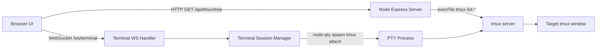
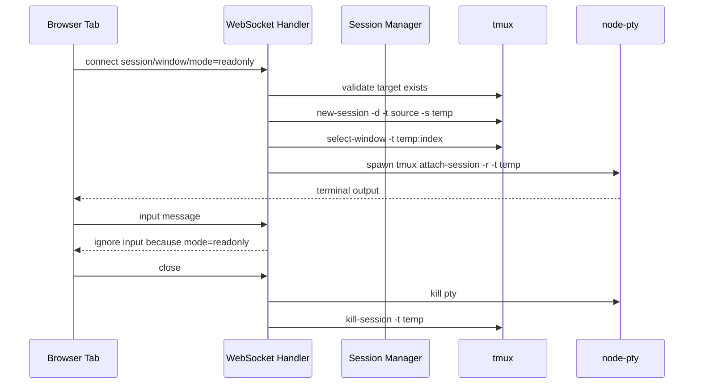
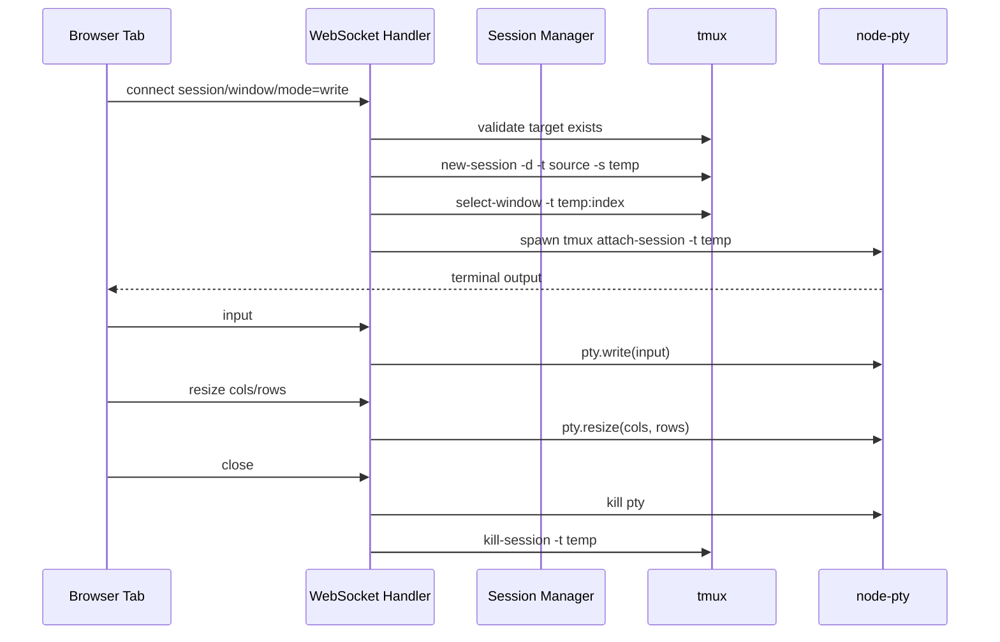

# Tmux Web Console 技术方案

日期：2026-05-27

项目目录：`/data00/home/hanyi.han/.codebase/personal_code/tmux-web-console`

## 1. 背景与目标

本项目是一个运行在 devbox 上的 Web 工具，用浏览器查看和操作当前 Linux 用户名下的 tmux sessions/windows。

核心目标：

1. 左侧展示 devbox 当前运行的 tmux session 列表。
2. 每个 session 下展示该 session 的 windows。
3. 每个 window 提供两个连接入口：
   - 只读连接：右侧终端实时展示该 tmux window 内容，不允许输入。
   - 可操作连接：右侧终端接入该 tmux window，允许键盘输入和交互。
4. 右侧主区域支持多个 tab，每个 tab 对应一个已连接的 tmux window。
5. tab 切换不主动断开连接，关闭 tab 才释放对应后端资源。

本方案默认它是个人 devbox 本地工具，只监听 `127.0.0.1`。如果未来需要给其他人访问，必须新增认证、授权、审计和命令权限隔离。

## 2. 用户场景

### 2.1 查看当前 tmux 运行状态

用户打开页面后，左侧自动加载 tmux session 树。每个 session 展示 session 名、window 数、是否 attached、创建时间等信息。每个 window 展示 window index、window name、active 状态、pane 数和 flags。

### 2.2 只读查看某个 window

用户点击 window 行上的只读按钮，右侧新开一个 tab，浏览器连接到该 window 并实时展示输出。只读 tab 内键盘输入被禁用，后端也会丢弃任何 input 消息。

适用场景：

- 查看长期运行命令输出。
- 观察 botmux/codex 任务进展。
- 查看日志或构建过程，不希望误操作。

### 2.3 可操作连接某个 window

用户点击 window 行上的可操作按钮，右侧新开一个 tab，并以真实终端方式连接该 window。用户可以输入命令、操作 nvim、less、top 等全屏程序。

适用场景：

- 远程浏览器内继续操作已有 tmux window。
- 在多个 tmux window 之间快速切换。
- 临时接管某个运行中的 shell。

### 2.4 多 tab 并行

右侧可以同时打开多个连接 tab。每个 tab 是独立的浏览器终端连接。切换 tab 只改变可见区域，不销毁连接。

## 3. 范围与非目标

### 3.1 本期范围

- Web 页面两栏布局。
- tmux session/window 树展示。
- 只读和可操作两种连接模式。
- 右侧多 tab 管理。
- xterm.js 终端展示、输入、resize。
- 后端 WebSocket 代理到真实 tmux attach。
- 连接清理和异常提示。
- 默认本机访问安全策略。

### 3.2 非目标

- 不做多用户账号系统。
- 不做公网访问。
- 不做细粒度命令白名单。
- 不做历史录屏回放。
- 不做跨机器 tmux 聚合。
- 不替代完整 SSH Web IDE。

这些能力可以作为后续版本演进，但不进入第一版实现范围。

## 4. 推荐技术栈

### 4.1 前端

- React
- TypeScript
- Vite
- xterm.js
- xterm-addon-fit
- lucide-react

选择理由：

- React 适合实现 session 树、tab 状态和终端组件拆分。
- TypeScript 可以共享前后端协议类型，降低 WebSocket 消息错误。
- Vite 本地开发速度快，适合 personal_code 下的小型 Web 工具。
- xterm.js 是浏览器终端渲染事实标准，能正确处理 ANSI escape sequence 和全屏终端应用。
- lucide-react 图标干净、轻量，适合工具型 UI。

### 4.2 后端

- Node.js
- TypeScript
- Express
- ws
- node-pty

选择理由：

- Node.js 与前端共用 TypeScript 类型和 package 管理。
- Express 足够承载本项目 API 和静态文件。
- ws 提供低层 WebSocket 控制，便于定义终端协议。
- node-pty 可以启动真实 pseudo-terminal，让 `tmux attach` 在后端拥有完整 TTY 能力。

### 4.3 tmux 依赖

devbox 当前环境已存在 `tmux 3.3a`。第一版按 tmux 3.x 设计。

关键 tmux 能力：

- `tmux list-sessions`
- `tmux list-windows -a`
- `tmux new-session -d -t <source-session> -s <temporary-session>`
- `tmux select-window -t <temporary-session>:<window-index>`
- `tmux attach-session -t <temporary-session>`
- `tmux attach-session -r -t <temporary-session>`
- `tmux kill-session -t <temporary-session>`

## 5. 总体架构



架构分层：

1. Browser UI：展示 session tree、tab bar、terminal view。
2. HTTP API：提供 tmux tree、health、静态资源。
3. WebSocket Gateway：处理 terminal output/input/resize/control message。
4. Terminal Session Manager：维护每个浏览器 tab 对应的后端 pty 和临时 tmux session。
5. Tmux Service：封装 tmux 命令调用、输出解析、target 校验。

## 6. 项目结构

建议目录：

```text
tmux-web-console/
  package.json
  tsconfig.json
  vite.config.ts
  docs/
    superpowers/
      specs/
        2026-05-27-tmux-web-console-technical-design.md
  src/
    client/
      main.tsx
      App.tsx
      api/
        tmuxApi.ts
        terminalSocket.ts
      components/
        Layout.tsx
        SessionSidebar.tsx
        SessionGroup.tsx
        WindowRow.tsx
        TerminalTabs.tsx
        TerminalPane.tsx
        EmptyState.tsx
        IconButton.tsx
      state/
        terminalTabs.ts
      styles/
        app.css
    server/
      index.ts
      config.ts
      routes/
        health.ts
        tmuxTree.ts
      ws/
        terminal.ts
      tmux/
        tmuxService.ts
        tmuxParser.ts
        tmuxTarget.ts
      terminal/
        terminalSessionManager.ts
        terminalSession.ts
      utils/
        logger.ts
        errors.ts
    shared/
      protocol.ts
      tmuxTypes.ts
```

模块边界：

- `src/shared` 只放类型和协议定义，不依赖 React 或 Node 专属 API。
- `src/client` 只通过 HTTP 和 WebSocket 访问后端，不直接拼 tmux 命令。
- `src/server/tmux` 只负责 tmux 查询、target 校验和命令封装。
- `src/server/terminal` 只负责 pty 生命周期，不关心 UI。

## 7. 数据模型

### 7.1 TmuxSession

```ts
export interface TmuxSession {
  name: string;
  createdAtEpoch?: number;
  attachedCount: number;
  windowCount: number;
  windows: TmuxWindow[];
}
```

### 7.2 TmuxWindow

```ts
export interface TmuxWindow {
  id: string;          // e.g. "@43"
  sessionName: string; // e.g. "main"
  index: number;       // e.g. 0
  name: string;        // e.g. "bash"
  active: boolean;
  paneCount: number;
  flags: string;       // tmux window_flags
}
```

### 7.3 TerminalTab

```ts
export type TerminalMode = "readonly" | "write";

export interface TerminalTab {
  tabId: string;
  title: string;
  sessionName: string;
  windowId: string;
  windowIndex: number;
  windowName: string;
  mode: TerminalMode;
  status: "connecting" | "connected" | "exited" | "error";
  createdAt: number;
  errorMessage?: string;
}
```

## 8. tmux 查询设计

### 8.1 查询 sessions

后端使用 `execFile` 调用 tmux，不通过 shell 拼接命令。

建议命令：

```bash
tmux list-sessions -F "#{session_name}\t#{session_created}\t#{session_attached}\t#{session_windows}"
```

输出字段：

- `session_name`
- `session_created`
- `session_attached`
- `session_windows`

### 8.2 查询 windows

建议命令：

```bash
tmux list-windows -a -F "#{session_name}\t#{window_id}\t#{window_index}\t#{window_name}\t#{window_active}\t#{window_panes}\t#{window_flags}"
```

输出字段：

- `session_name`
- `window_id`
- `window_index`
- `window_name`
- `window_active`
- `window_panes`
- `window_flags`

### 8.3 输出解析

tmux 输出使用 tab 分隔。parser 规则：

1. 每行按 `\t` 拆分。
2. 字段数量不满足预期时丢弃该行并记录 warning。
3. 数字字段使用 `Number.parseInt` 严格转换。
4. boolean 字段只接受 `"0"` 或 `"1"`。
5. session/window 名称原样展示，但后续命令 target 只能使用后端已解析出的合法 id/index。

### 8.4 无 tmux server

当 `tmux list-sessions` 返回非零且 stderr 包含 `no server running` 时，API 返回空数组，不当作后端异常。

页面显示：

- 标题：No tmux sessions
- 描述：当前用户下没有运行中的 tmux server。
- 操作：刷新按钮。

## 9. 连接生命周期设计

### 9.1 为什么使用 grouped session

直接 attach 原 session 可能会改变用户原 tmux client 的当前 window，或者多个 Web tab 之间相互影响。第一版采用临时 grouped session：

1. 从源 session 创建一个临时 grouped session。
2. 临时 session 与源 session 共享 windows。
3. 临时 session 有独立当前 window。
4. Web tab attach 到临时 session。
5. WebSocket 关闭后 kill 临时 session。

这样可以做到：

- 不破坏原 session 的 windows。
- 每个 Web tab 有独立 current window。
- 多个 tab 互不抢焦点。
- 清理临时 session 不会 kill 原 window。

### 9.2 只读连接流程



后端防线：

- WebSocket 建连参数中 `mode=readonly`。
- 前端不绑定输入。
- 后端收到 input 消息后直接忽略。
- tmux attach 使用 `-r`。

### 9.3 可操作连接流程



### 9.4 临时 session 命名

格式：

```text
__tmux_web_<short_uuid>
```

示例：

```text
__tmux_web_a3f921c4
```

命名要求：

- 不使用用户输入直接拼接。
- UUID 由后端生成。
- 服务启动时可以扫描并清理孤儿临时 session。

### 9.5 断连清理

触发清理的场景：

- 用户关闭 tab。
- 浏览器刷新。
- WebSocket 断开。
- pty 退出。
- 后端进程收到 SIGINT/SIGTERM。

清理步骤：

1. 关闭 WebSocket。
2. kill pty process。
3. `tmux kill-session -t <temp-session>`。
4. 从 Session Manager registry 中移除。
5. 向前端发送 exit/status 消息。

## 10. HTTP API 设计

### 10.1 GET /api/health

返回服务和 tmux 可用性。

响应示例：

```json
{
  "ok": true,
  "tmux": {
    "available": true,
    "version": "tmux 3.3a"
  }
}
```

### 10.2 GET /api/tmux/tree

返回 session/window 树。

响应示例：

```json
{
  "sessions": [
    {
      "name": "main",
      "createdAtEpoch": 1779893212,
      "attachedCount": 0,
      "windowCount": 2,
      "windows": [
        {
          "id": "@43",
          "sessionName": "main",
          "index": 0,
          "name": "bash",
          "active": false,
          "paneCount": 1,
          "flags": "-"
        }
      ]
    }
  ]
}
```

错误响应：

```json
{
  "error": {
    "code": "TMUX_UNAVAILABLE",
    "message": "tmux command is not available"
  }
}
```

## 11. WebSocket 协议设计

### 11.1 建连 URL

```text
/ws/terminal?session=main&window=@43&mode=readonly
/ws/terminal?session=main&window=@43&mode=write
```

参数：

- `session`：源 session name。
- `window`：tmux window id，格式类似 `@43`。
- `mode`：`readonly` 或 `write`。

后端校验：

1. `mode` 必须是允许枚举。
2. `session` 必须存在。
3. `window` 必须属于该 session。
4. 校验通过后才创建临时 grouped session。

### 11.2 Client -> Server

```ts
export type ClientTerminalMessage =
  | { type: "input"; data: string }
  | { type: "resize"; cols: number; rows: number }
  | { type: "ping"; now: number }
  | { type: "close" };
```

处理规则：

- `input`：只在 write 模式下转发给 pty。
- `resize`：限制 cols/rows 合法范围后转发给 pty。
- `ping`：返回 pong，用于前端判断连接健康。
- `close`：主动关闭当前连接。

### 11.3 Server -> Client

```ts
export type ServerTerminalMessage =
  | { type: "ready"; connectionId: string; readonly: boolean }
  | { type: "output"; data: string }
  | { type: "status"; status: "connecting" | "connected" | "exited" | "error" }
  | { type: "pong"; now: number }
  | { type: "error"; code: string; message: string }
  | { type: "exit"; exitCode: number | null; signal: string | null };
```

处理规则：

- `output` 直接写入 xterm。
- `ready` 后前端把 tab 状态切到 connected。
- `exit` 后 tab 保留，但显示可关闭/重连状态。
- `error` 显示错误 banner，不自动关闭 tab。

## 12. 前端 UI 设计

### 12.1 整体布局

页面采用左右两栏：

- 左栏：固定宽度 320px，最小 280px，最大 420px，可滚动。
- 右栏：flex: 1，包含 tab bar 和 terminal area。
- 页面高度：100vh。
- 终端区域：填满剩余空间，背景使用深色。

布局草图：

```text
+-------------------------------+------------------------------------------+
| App title / refresh / search   | Tab bar                                  |
|------------------------------- |------------------------------------------|
| Session: main                  | [main:0 readonly] [scs_i18n:2 write]     |
|   Window 0 bash      [eye][kbd] |------------------------------------------|
|   Window 1 dev       [eye][kbd] |                                          |
| Session: scs_i18n              |             xterm terminal               |
|   Window 0 nvim      [eye][kbd] |                                          |
|   Window 1 prompt    [eye][kbd] |                                          |
|   Window 2 terminal  [eye][kbd] |                                          |
+-------------------------------+------------------------------------------+
```

### 12.2 视觉风格

定位：工具型、安静、高密度、适合反复使用。

建议风格：

- 左侧浅色或中性色背景，强调可扫描性。
- 右侧终端深色背景，贴近真实 terminal。
- 控件紧凑，不使用大面积营销式卡片。
- 按钮以 icon button 为主，文字仅用于关键状态。
- 每个 window 行固定高度，避免 hover 或状态变化导致布局跳动。

### 12.3 图标体系

图标库使用 `lucide-react`。所有 icon button 必须带 tooltip 和 `aria-label`。

#### 12.3.1 应用与布局

| 场景 | 图标 | 用途 |
| --- | --- | --- |
| 应用标识 | `SquareTerminal` | 左上角项目标识，表达 Web terminal 工具 |
| 左栏展开/收起 | `PanelLeft` | 切换 session sidebar 显示状态 |
| 右侧主区域 | `PanelRight` | 在布局设置或空状态中表示终端区域 |
| 多 tab | `PanelsTopLeft` | 表达多个连接面板 |
| 设置 | `Settings` | 未来放主题、刷新间隔等配置 |

#### 12.3.2 session/window 树

| 场景 | 图标 | 用途 |
| --- | --- | --- |
| session | `Server` | session 分组标题 |
| session 已 attached | `Link` | 表示已有 tmux client attached |
| session 未 attached | `Unlink` | 表示当前无人 attached |
| session 展开 | `ChevronDown` | 展开 session |
| session 折叠 | `ChevronRight` | 折叠 session |
| window | `Terminal` | window 行主图标 |
| active window | `CircleDot` | 当前 active window 状态 |
| inactive window | `Circle` | 非 active window 状态 |
| 多 pane | `Columns2` | window 内有多个 pane |
| 刷新列表 | `RefreshCw` | 重新拉取 tmux tree |
| 搜索过滤 | `Search` | 过滤 session/window |

#### 12.3.3 window 操作按钮

| 操作 | 图标 | Tooltip | 行为 |
| --- | --- | --- | --- |
| 只读连接 | `Eye` | 只读查看 | 打开 readonly tab |
| 可操作连接 | `Keyboard` | 可操作连接 | 打开 write tab |
| 重连 | `RotateCw` | 重新连接 | 复用 tab target 重新建连 |
| 关闭 tab | `X` | 关闭连接 | 关闭 WebSocket 并清理临时 session |
| 复制 target | `Copy` | 复制 tmux target | 复制 session/window target |

#### 12.3.4 连接状态

| 状态 | 图标 | 显示位置 |
| --- | --- | --- |
| connecting | `LoaderCircle` | tab 左侧，旋转动画 |
| connected | `Activity` | tab 左侧，绿色状态点 |
| readonly | `Lock` | tab badge |
| writable | `Unlock` | tab badge |
| exited | `Power` | tab badge 或 terminal overlay |
| error | `AlertTriangle` | tab badge 和错误 banner |
| disconnected | `WifiOff` | terminal overlay |
| security notice | `Shield` | 首次可操作连接提示 |

#### 12.3.5 图标交互规范

- icon button 尺寸：32px x 32px。
- 图标尺寸：16px 或 18px。
- hover 背景：轻微灰色变化。
- active 状态：使用 accent border 或背景色，不改变按钮尺寸。
- disabled 状态：降低 opacity，保留 tooltip 解释原因。
- 可操作连接按钮使用更强视觉权重，避免和只读按钮混淆。
- tab 上 mode badge 使用 `Lock` / `Unlock`，比纯文字更快识别。

## 13. 前端状态管理

第一版不需要引入复杂状态库，可以使用 React hooks + reducer。

### 13.1 核心状态

```ts
interface AppState {
  sessions: TmuxSession[];
  sessionsLoading: boolean;
  sessionsError?: string;
  filterText: string;
  expandedSessions: Record<string, boolean>;
  tabs: TerminalTab[];
  activeTabId?: string;
}
```

### 13.2 tab 行为

- 点击只读/可操作按钮总是新开 tab。
- tab title 格式：`<session>:<window-index> <window-name>`。
- 如果同一个 window 已经有同模式 tab，可以提供“切换到已有 tab”提示，但第一版不强制去重。
- 关闭 active tab 后，自动切到左侧最近一个 tab；没有 tab 时显示空状态。
- 页面刷新会断开所有 WebSocket，第一版不恢复历史 tab。

### 13.3 终端组件生命周期

TerminalPane mount：

1. 创建 xterm Terminal 实例。
2. 加载 FitAddon。
3. 建立 WebSocket。
4. 收到 output 后 `terminal.write(data)`。
5. write 模式下绑定 `terminal.onData`。
6. ResizeObserver 触发 fit 并发送 cols/rows。

TerminalPane unmount：

1. 关闭 WebSocket。
2. dispose xterm。
3. 清理 ResizeObserver。

## 14. 后端模块设计

### 14.1 TmuxService

职责：

- 检测 tmux 是否可用。
- 查询 session/window tree。
- 校验 target 是否存在。
- 创建临时 grouped session。
- 选择目标 window。
- 清理临时 session。

接口草案：

```ts
class TmuxService {
  getVersion(): Promise<string>;
  getTree(): Promise<TmuxTree>;
  assertWindowTarget(sessionName: string, windowId: string): Promise<TmuxWindow>;
  createGroupedSession(sourceSession: string): Promise<string>;
  selectWindow(tempSession: string, windowIndex: number): Promise<void>;
  killSession(sessionName: string): Promise<void>;
}
```

实现要求：

- 使用 `child_process.execFile`。
- 不使用 shell。
- 对 tmux 命令设置 timeout。
- stderr 记录到 server log，但对前端返回脱敏错误。

### 14.2 TerminalSessionManager

职责：

- 创建 terminal session。
- 分配 connectionId。
- 管理 pty process。
- 管理 temp tmux session。
- 统一清理资源。
- 处理进程退出和 WebSocket 断开。

接口草案：

```ts
class TerminalSessionManager {
  create(input: CreateTerminalSessionInput): Promise<TerminalSession>;
  get(connectionId: string): TerminalSession | undefined;
  close(connectionId: string, reason: string): Promise<void>;
  closeAll(reason: string): Promise<void>;
}
```

### 14.3 TerminalSession

职责：

- 持有 pty。
- 连接 pty data 到 WebSocket output。
- 连接 WebSocket input 到 pty.write。
- 处理 resize。
- 根据 mode 执行只读/可写策略。

## 15. 安全设计

### 15.1 权限模型

第一版权限模型：

- 后端以当前 Linux 用户身份运行。
- 可操作连接等价于该用户在 tmux 中直接输入。
- 只读连接可以读取终端内容，仍然可能包含敏感信息。
- 服务默认只监听 `127.0.0.1`。

### 15.2 命令注入防护

要求：

- 所有 tmux 调用使用 `execFile` 或 `spawn` 参数数组。
- 不用字符串拼 shell 命令。
- `session` 和 `window` 参数必须来自后端当前查询到的 tmux tree。
- 临时 session 名只由后端生成。

### 15.3 网络暴露防护

默认配置：

```ts
host: "127.0.0.1"
port: 5179
```

如果未来需要 `0.0.0.0`：

1. 必须显式配置开关。
2. 必须添加访问 token。
3. 可操作连接需要二次确认。
4. server log 记录连接来源、target、mode、开始/结束时间。

### 15.4 可操作连接提示

第一次点击可操作连接时，前端显示轻量确认：

- 图标：`Shield`
- 文案：可操作连接会把键盘输入发送到 tmux window。
- 操作：继续连接。

该提示只在当前浏览器 session 内显示一次。

## 16. 错误处理

### 16.1 错误码

| 错误码 | 含义 | 前端表现 |
| --- | --- | --- |
| `TMUX_UNAVAILABLE` | tmux 命令不存在 | 左侧错误状态 |
| `TMUX_NO_SERVER` | 当前无 tmux server | 左侧空状态 |
| `TARGET_NOT_FOUND` | session/window 不存在 | tab error |
| `PTY_START_FAILED` | pty 启动失败 | tab error |
| `WS_PROTOCOL_ERROR` | WebSocket 消息不合法 | 关闭连接并提示 |
| `READONLY_INPUT_IGNORED` | 只读输入被忽略 | 不弹窗，仅 debug log |
| `CLEANUP_FAILED` | 临时 session 清理失败 | server warning |

### 16.2 session/window 消失

如果用户打开页面后，目标 window 被外部 tmux client 删除：

- 新建连接时：后端返回 `TARGET_NOT_FOUND`。
- 已连接 tab：tmux attach 退出，前端显示 exited 状态。
- 左侧刷新后不再显示该 window。

### 16.3 连接退出

tmux attach 退出时：

- tab 状态变成 exited。
- terminal overlay 显示退出信息。
- 用户可以关闭 tab。
- 如果目标仍存在，用户可以点击重连。

## 17. 性能与资源控制

### 17.1 前端

- session tree 手动刷新为主，可以提供 5s/10s 自动刷新开关。
- inactive tab 保持 WebSocket，不重新渲染 xterm DOM。
- xterm scrollback 默认 5000 行。
- 终端 resize 使用 debounce，避免频繁发送。

### 17.2 后端

- 每个 tab 对应一个 pty process 和一个临时 grouped session。
- 默认最大连接数建议 20。
- 单个 IP 或本地用户场景下不做复杂限流。
- 服务退出时 `closeAll` 清理所有临时 session。

### 17.3 孤儿资源清理

服务启动时：

1. 调用 `tmux list-sessions`。
2. 找出名称以 `__tmux_web_` 开头的 session。
3. 可配置是否自动清理。

默认策略：

- 清理当前服务创建且仍登记在 pid file/registry 中的 orphan。
- 对未知来源同名前缀 session 记录 warning，避免误删手工创建 session。

第一版可以简化为：只在当前进程生命周期内保证清理，不做跨进程 orphan 清理。

## 18. 测试方案

### 18.1 单元测试

覆盖：

- `tmuxParser`：
  - 正常 session/window 输出解析。
  - 空输出。
  - 字段缺失。
  - 数字字段非法。
- `tmuxTarget`：
  - session/window 存在校验。
  - window 不属于 session。
  - 非法 mode。
- `terminalTabs` reducer：
  - 新增 tab。
  - 切换 tab。
  - 关闭 active tab。
  - status 更新。

### 18.2 集成测试

使用临时 tmux session：

1. `tmux new-session -d -s __test_tmux_web_console 'bash'`
2. `tmux new-window -t __test_tmux_web_console -n logs`
3. 调用 `/api/tmux/tree` 验证能列出 session/window。
4. WebSocket 连接 readonly，验证收到输出。
5. WebSocket 连接 write，发送 `echo hello\n`，验证输出包含 hello。
6. 关闭连接，验证临时 grouped session 被清理。
7. kill 测试 session。

### 18.3 手工验收

验收清单：

- 左侧能列出当前 devbox 真实 tmux sessions/windows。
- session 可展开/折叠。
- 刷新按钮能重新拉取 tmux tree。
- 点击 `Eye` 打开只读 tab。
- 只读 tab 能显示内容，但输入不会进入 tmux。
- 点击 `Keyboard` 打开可操作 tab。
- 可操作 tab 可以输入命令。
- nvim、less、top 等全屏应用 resize 后显示正常。
- 多 tab 切换不断连。
- 关闭 tab 后后端临时 session 被清理。
- session/window 被删除时，前端能显示合理错误。
- 服务只监听 `127.0.0.1`。

## 19. 开发与运行方式

### 19.1 开发态

建议命令：

```bash
npm install
npm run dev
```

开发态服务：

- Web 页面：`http://127.0.0.1:5179`
- API：同端口 `/api/*`
- WebSocket：同端口 `/ws/terminal`

### 19.2 生产态或本地长期运行

建议命令：

```bash
npm run build
npm run start
```

后续可以增加：

- systemd user service。
- pm2 配置。
- tmux 内自启动脚本。

## 20. 实施阶段拆分

### 阶段 1：项目骨架和基础页面

目标：

- 初始化 Vite + React + TypeScript。
- 搭建 Express server。
- 页面左右两栏布局。
- 静态 session/window mock 展示。
- 图标按钮和 tab 样式完成。

### 阶段 2：tmux tree API

目标：

- 实现 `TmuxService.getTree`。
- 解析真实 tmux sessions/windows。
- 前端接入 `/api/tmux/tree`。
- 完成刷新、空状态、错误状态。

### 阶段 3：WebSocket + readonly terminal

目标：

- 实现 terminal WebSocket。
- node-pty 启动 readonly tmux attach。
- xterm.js 展示输出。
- 禁止输入。
- 关闭 tab 清理资源。

### 阶段 4：write terminal

目标：

- 支持可操作连接。
- 支持 input。
- 支持 resize。
- 增加可操作连接提示。

### 阶段 5：稳定性和验收

目标：

- 增加 parser/reducer 单元测试。
- 增加临时 tmux 集成测试。
- 验证多 tab、异常退出、清理逻辑。
- 完善 README 和运行说明。

## 21. 关键技术风险

### 21.1 tmux target 选择影响原 session

风险：错误使用 tmux target 可能改变用户原 tmux client 的当前 window。

缓解：

- 使用临时 grouped session。
- 在临时 session 内 select-window。
- 每个 browser tab 单独创建 grouped session。

### 21.2 只读模式误输入

风险：前端 bug 导致只读 tab 发送 input。

缓解：

- 前端不绑定 input。
- 后端按 mode 丢弃 input。
- tmux attach 使用 `-r`。

### 21.3 Web 服务被外部访问

风险：可操作模式等价于命令执行能力。

缓解：

- 默认 host 固定为 `127.0.0.1`。
- 文档明确不支持公网暴露。
- 未来外部访问必须加 token 和审计。

### 21.4 终端 resize 和全屏程序兼容性

风险：nvim/top/less 显示错位。

缓解：

- 使用 xterm fit addon。
- ResizeObserver 后发送 pty resize。
- 手工验收覆盖全屏程序。

## 22. 推荐默认配置

```ts
export const defaultConfig = {
  host: "127.0.0.1",
  port: 5179,
  maxConnections: 20,
  ptyDefaultCols: 120,
  ptyDefaultRows: 32,
  terminalScrollback: 5000,
  tmuxCommandTimeoutMs: 5000,
  tempSessionPrefix: "__tmux_web_",
  enableWriteMode: true
};
```

## 23. 后续可选增强

后续增强不影响第一版交付：

- 支持搜索 session/window。
- 支持收藏常用 session。
- 支持 tab 持久化和刷新后重连。
- 支持主题切换。
- 支持导出 terminal scrollback。
- 支持连接审计日志。
- 支持一次性访问 token。
- 支持将 readonly tab 分享给其他只读用户。

## 24. 结论

推荐采用 `React + TypeScript + xterm.js + Node.js + Express + ws + node-pty` 方案。

该方案的关键点是：浏览器不直接模拟 tmux 协议，而是让后端启动真实 pty 并 attach 到临时 grouped tmux session。这样可以最大化复用 tmux 和终端本身的成熟能力，减少自研终端交互逻辑，同时通过 readonly/write 两种连接模式满足查看和操作两个核心场景。

第一版按个人 devbox 本地工具交付，默认只监听 `127.0.0.1`，避免把可操作 tmux 的能力暴露到不可信网络。
